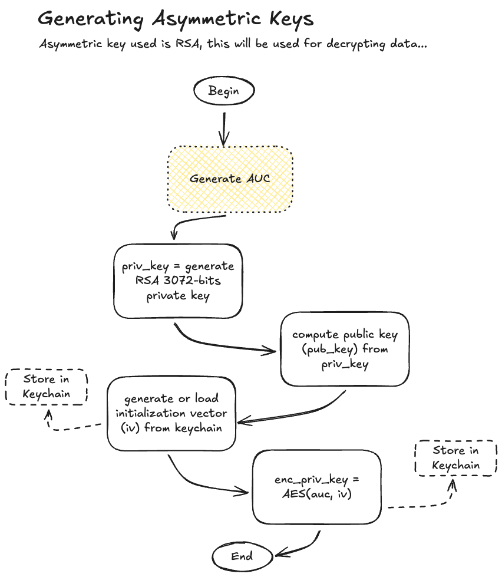

[![Unlicense License][license-shield]][license-url]


<br />
<div align="center">
  <a href="https://github.com/rmscoal/Best-README-Template">
    
  </a>
<h1 align="center">Viscue</h1>
  <p align="center">
    Your personal password manager on terminal!
  </p>
</div>

## About
<p align="left"><strong>Do you like to keep secrets 🤫?</strong> Cause I do!</p>
<p align="right"><strong>You like to keep them safe?</strong> Oh yeahh!!</p>
<p align="left"><strong>And you work within the terminal?</strong> Yup 🤓!</p>
<p align="center"><strong>Viscue</strong> is your answer!</p>

With Viscue you can store,
retrieve and generate strong passwords while keeping them encrypted and safe all without leaving your terminal.
Viscue is a TUI app making it easy to use and navigate.

https://github.com/user-attachments/assets/337a2af2-169c-4759-918e-b92b6fa2e959

## Features
- 🔒 Secure password storage with strong encryption
- 🔑 Password generation with customizable options
- 📋 Easy copy-paste functionality
- 🔍 Search and filter capabilities
- and more coming !!!

## Security
Viscue stores your password locally inside an embedded SQLite database. 
Passwords are never stored as is, instead they are encrypted using your private key.
Furthermore, your private key is encrypted and stored locally within your system's keychain.

Technically, Viscue took inspiration from both 1Password's [white paper](https://1passwordstatic.com/files/security/1password-white-paper.pdf) and BitWarden's [white paper](https://www.avangate.it/wp-content/uploads/2024/04/help-bitwarden-security-white-paper.pdf).
The blend resulted in the following simplified algorithm:




Feel free to explore the code to enhance and fortify Viscue's security.

## Installation
Pick your installation of choice.

- Mac
    ```sh
    brew install viscue
    ```
- Go (version 1.21+ required)
    ```sh
    go install github.com/rmscoal/viscue/cmd/viscue/main.go@latest
    ```

## Contributing
You people are very welcome to contribute. Remember to start the project.

1. Fork the Project
2. Create your Feature Branch (`git checkout -b feat/amazing_feature`)
3. Commit your Changes (`git commit -m 'feat: added an amazing feature'`)
4. Push to the Branch (`git push origin feat/amazing_feature`)
5. Open a Pull Request


<!-- MARKDOWN LINKS & IMAGES -->
<!-- https://www.markdownguide.org/basic-syntax/#reference-style-links -->
[license-shield]: https://img.shields.io/github/license/rmscoal/viscue.svg?style=for-the-badge
[license-url]: https://github.com/rmscoal/viscue/blob/master/LICENSE.txt
